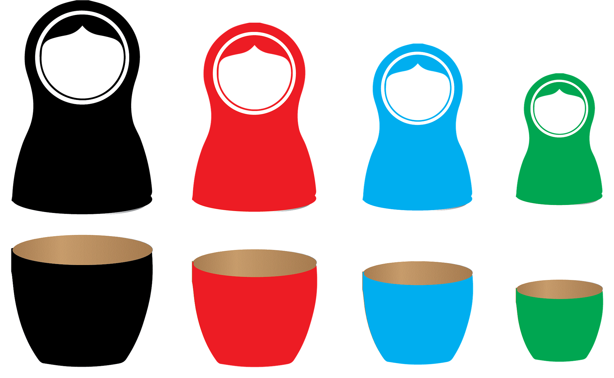

## Adding text to your webpage

Now that you have a card on the page, it's time to put something in it! Since these will be cards about countries, the most important thing to display is probably the name of the country, so make that a heading on the card.

--- task ---
Update the 'makeCard' function to include making a `h2` heading, adding a country name inside it and then making that heading a child of 'card':

```javascript
function makeCard() {
    
    var card = document.createElement("div");
    card.classList.add("item-card");

    var heading = document.createElement("h2");
    var text = document.createTextNode("Ireland");
    heading.appendChild(text);

    card.appendChild(heading);

    return card;
}
```
--- /task ---

There are a couple of things to notice in this change: First, how regularly we deal with properly 'nesting' (think nesting dolls, not birds) one element inside of another and, second, how much of a pain adding text is going to be if it takes three lines of code to do it every time! 



Since it's basically the same three lines — the only differences being element you're creating and what text you're putting in it — that sounds like a great bit of code to wrap up in a function.

--- task ---
Crerate a 'textTag' function that will accept a HTML tag along with some text to nest inside it and return the completed element for you to work with:

```javascript
function textTag(tagName, textContents) {
    var tag = document.createElement(tagName);
    var text = document.createTextNode(textContents);
    tag.appendChild(text);
    return tag;
}
```
--- /task ---

--- task ---
Now clean up your 'makeCard' function to use 'textTag':

```javascript
function makeCard() {
    
    var card = document.createElement("div");
    card.classList.add("item-card");

    card.appendChild(textTag("h2","Ireland"));

    return card;
}
```
--- /task ---