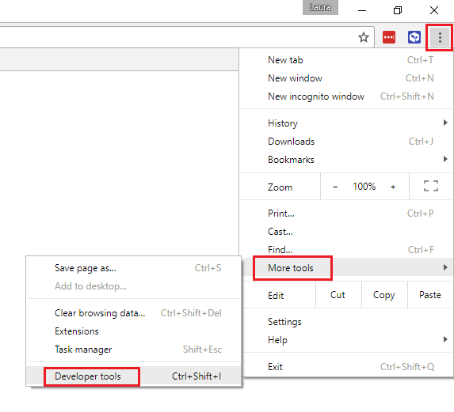

## Getting country data

Of course, there are a lot of countries in the world and even just typing in all their names would get way too boring. Luckily, you're a computer programmer and someone has already made a handy list of information about countries you can use! 

You can check out the list at https://restcountries.eu/rest/v2/all. Kinda huge, isn't it! Don't worry about reading it though. You're going to get the computer to do that for you, which should be pretty easy since it's in a format called JSON.

JSON is a format for storing and sharing data. JSON (say Jason) stands for JavaScript Object Notation, but it isn't just used with JavaScript. 

JSON is a text format that can be used in code and is fairly easy for people to read. 

```json
{
  "name": "Ogre",
  "size": 90,
  "power": 86,
  "intelligence": 12,
  "magic": 0
}
```

A JSON **object** is a list of key-value pairs inside curly brackets `{}`.

A value can also be a **list** inside square brackets `[]`:

```json
{
  "name": "Ogre",
  "size": 90,
  "power": 86,
  "intelligence": 12,
  "magic": 0,
  "weapons" : ["club", "rock", "bone"]
}
```

For now, all you need to do is get the JSON into your program and check that it has properly loaded.

--- task ---
Create a variable, outside of any function (so it can be accessed by all of them) called 'countries':

```javascript
var countries;
```
--- /task ---

--- task ---
Create a function called 'fetchAllCountries' like this:

```javascript
async function fetchAllCountries() {
    var response = await fetch("https://restcountries.eu/rest/v2/all");
    return await response.json();
}
```
--- /task ---

This function looks relatively normal: fetching the URL, taking the response and returning it as JSON. However, look at a couple of unusual things here:
  1. Instead of `function`, this is declared as `async function`
  2. Twice, JavaScript is told to `await` something
These two **keywords** always come as a pair — only an `async` function can contain `await`. What `await` means is that, instead of sending off the `fetch` and forgetting about the response back from restcountries, JavaScript should pause to `await` the `fetch` being completed, and then pause to `await` the `response` being retrieved as `json`. This means the code doesn't get ahead of itself and try to use the information before restcountries has sent it back!

Now, you may also have noticed that this function doesn't put the information about countries into the variable created for them. This is deliberate — you'll do that job at the start of the 'displayCountries' function, so you can make it `await` them. This avoids 'displayCountries' trying to create cards for countries before 'fetchAllCountries' has fetched the data used to make the cards!

--- task ---
Update 'displayCountries' to call 'fetchAllCountries'. Note that 'displayCountries' has to become an `async function` to do this! Also, have it output 'countries' to the console, so you can check whether you're successfully retreiving the data.

```javascript
async function displayCountries() {
    countries = await fetchAllCountries();

    console.log(countries);

    var cardContainer = document.getElementById("card-container")
    
    cardContainer.appendChild(makeCard());
}
```
--- /task ---

The console is the part of your browser where you can see messages output by JavaScript, for example about errors. However, you can also send messages directly to it using `console.log`. In this case, it will print out the whole array of countries, which you should be able to click to expand and read through. There may be some other messages in there when you open the console — just ignore them. You will access the console differently depending on your browser:

### Google Chrome
Click the three dots on the far right of the address bar, then click **More tools** > **Developer tools**.


### Microsoft Internet Explorer / Edge
Press **F12** and then click on the tab labelled **console**


### Safari
In the top menu, click on **Develop** > **Show Error Console**. If your menu does not have **Develop** on it, enable the developer tools by clicking on **Safari** > **Preferences** and then on the **Advanced** tab. There, tick the box labelled **Show Develop menu in menu bar**.